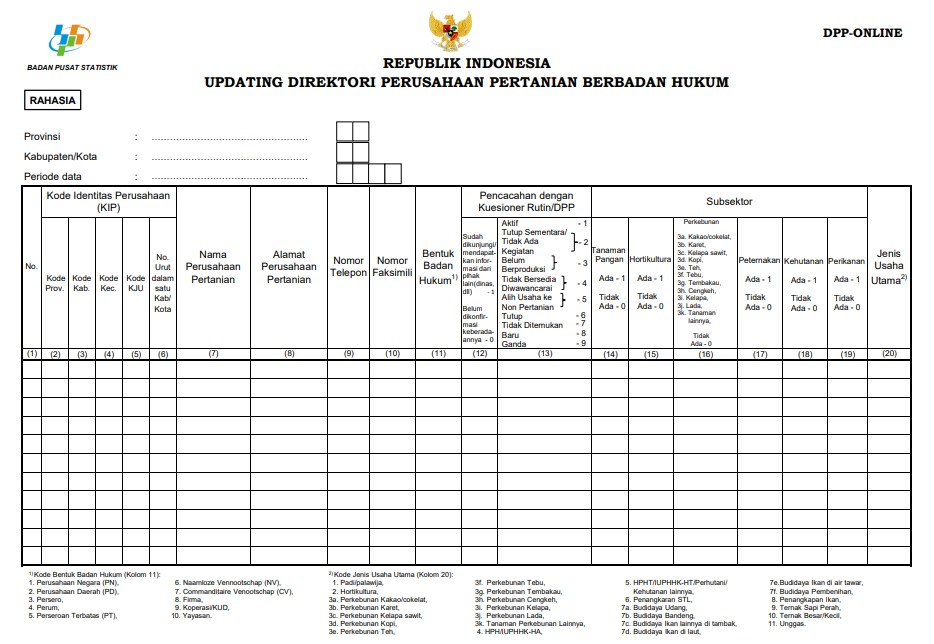
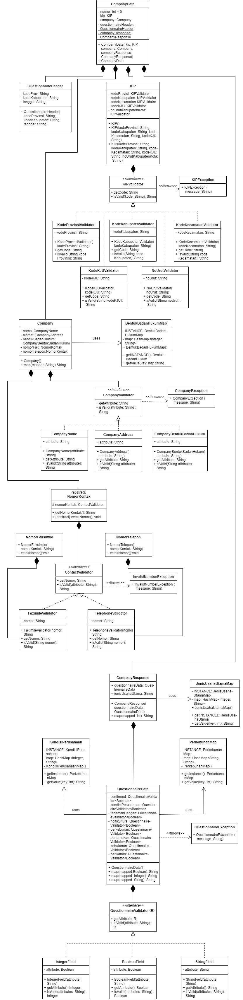

# Aplikasi Updating Direktori Perusahaan Pertanian Berbadan Hukum
Updating Direktori Perusahaan Pertanian adalah salah satu rangkaian kegiatan dari ST2023 yang dilakukan tahun 2022. Tujuan dari Updating DPP adalah untuk memperoleh direktori yang lengkap dan terkini dari perusahaan pertanian yang akan digunakan sebagai dasar pencacahan lengkap pada tahun 2023.

## Pemrograman Berorientasi Objek

#### Penulis Kode Sumber :sun_with_face:
##### Kelompok 6
1. Muhammad Julian Firdaus - 222112217 :boy:
2. Muhammad Restu Ilahi - 222112222 :boy:
3. Natalie Merry Angelina - 222112243 :girl:
3. Rifky Maulana Putra - 222112322 :boy:
4. Rizky Rahmadani - 222112332 :boy:
5. Sabilla Hamda Syahputri - 222112344 :girl:

## Deskripsi Singkat :milky_way:
Aplikasi ini digunakan untuk mengumpulkan dan menyimpan data perusahaan pertanian pada sensus pertanian guna melakukan pembaharuan data direktori pertanian. Aplikasi ini juga menggunakan validator yang akan memvalidasi apakah inputan yang dimasukkan user ke dalam form Updating Direktori Perusahaan Pertanian Berbadan Hukum tersebut sudah benar dan sesuai dengan nilai yang ditentukan atau belum. Dalam form tersebut terdapat 20 kolom yang harus diisi responden. Berikut tampilan formulir dari Updating Direktori Perusahaan Pertanian Berbadan Hukum.

Pada gambar tersebut tampak ada 20 kolom yang harus diisi oleh petugas ataupun responden ketika proses wawancara. Jawaban yang akan diisikan ke dalam kolom tersebut ditentukan karena pertanyaan yang diajukan merupakan pertanyaan tertutup. Untuk itu, diperlukan validator demi menghindari jawaban yang diinput merupakan jawaban yang tidak sesuai dan tidak diharapkan. 

## UML Diagram :bar_chart:
Untuk membuat aplikasi validator Form Updating Direktori Perusahaan Pertanian Berbadan Hukum ini berpedoman pada UML Diagram berikut.

## Aturan Validasi :pencil2:
Pada form Updating Direktori Perusahaan Pertanian Berbadan Hukum tersebut terdapat 20 kolom dengan aturan validasi yang berbeda-beda. Berikut aturan validasi pada tiap kolom tersebut.

##### 1. Nomor
- Jawaban yang diinput harus berupa angka yang urut dari nomor yang ada sebelumnya.
- Tidak boleh berupa huruf atau simbol-simbol lainnya.

##### 1. Kode Provinsi
- Kode hanya berupa angka.
- Kode Provinsi terdiri atas 2 digit.
- Kode Provinsi diawali angka 1-9.
- Kode Provinsi diakhiri 1-9.

##### 3. Kode Kab/Kota
- Kode harus berupa angka, bukan huruf atau simbol apapun.
- Kode Kab/Kota tediri atas 2 digit.
- Kode Kab/Kota harus diawali 0 atau 7. Dengan keterangan 0 merupakan kabupaten dan 7 merupakan kota.
- Kode Kab/Kota diakhiri 1-9.

##### 4. Kode Kecamatan
- Kode kecamatan harus berupa angka, bukan huruf atau simbol apapun.
- Kode kecamatan terdiri atas 2 digit.
- Karena kecamatan di Indonesia tidak ada yang lebih dari 50 di satu kabupaten/kota, maka jika yang diinput diatas 50 akan error.

##### 5. Kode KJU
- Kode KJU harus berupa angka, bukan huruf atau simbol apapun.
- Kode KJU terdiri atas 2 digit.
- Digit pertama Kode KJU harus berupa angka 0.
- Digit kedua Kode KJU berupa angka 1-7.

##### 6. Nomor Urut
- Nomor Urut harus berupa angka, bukan huruf atau simbol apapun.

##### 7. Nama Perusahaan Pertanian
- Nama Perusahaan Pertanian hanya berupa huruf kecil maupun besar, spasi, dan operasi bitwise OR. 
- Nama Perusahaan Pertanian tidak boleh kurang dari 3 huruf.
- Nama Perusahaan Pertanian tidak boleh lebih dari 30 huruf.

##### 8. Alamat Perusahaan
- Alamat Perusahaan berupa huruf, angka, dan spasi.
- Alamat Perusahaan dibatasi hanya sampai 250 huruf.

##### 9. Nomor Telepon
- Nomor Telepon harus berupa angka, bukan huruf maupun simbol lainnya.
- Nomor Telepon dibatasi hanya sampai 15 digit.
- Nomor Telepon harus lebih dari 8 digit.
- Nomor Telepon diawali dengan angka 0.

##### 10. Nomor Faksimili
- Nomor Faksimili harus berupa angka, bukan huruf maupun simbol lainnya.
- Nomor Faksimili dibatasi hanya sampai 15 digit.
- Nomor Faksimili harus lebih dari 8 digit.
- Nomor Faksimili diawali dengan angka 0.

##### 11. Bentuk Badan Hukum
- Bentuk Badan Hukum harus berupa angka
- Inputan hanya berupa angka 1-10 jika perusahaan punya Bentuk Badan Hukum yang ada di daftar.

##### 12. Status Kunjungan
- Kolom PStatus Kunjungan berupa pilihan Ya atau Tidak.
- Nilai yang diizinkan 1 (Ya) dan 0 (Tidak).
- Jika pilihan 0 artinya kolom 13-20 tidak bisa diperoleh nilainya.

##### 13. Kondisi Perusahaan
- Kondisi Perusahaan harus berupa angka.
- Inputan angka terbatas pada rentang 1-9
- Setiap angka mewakili jawaban sesuai yang tertera pada daftar jawaban kolom 13 kuesioner DPP.

##### 14. Tanaman Pangan 
- Kolom Tanaman Pangan berupa pilihan Ya atau Tidak.
- Nilai yang diizinkan 1 (Ya) dan 0 (Tidak).

##### 15. Hortikultura
- Kolom Hortikultura berupa pilihan Ya atau Tidak.
- Nilai yang diizinkan 1 (Ya) dan 0 (Tidak).

##### 16. Perkebunan
- Kolom perkebunan berupa kombinasi huruf dan angka.
- Nilai yang diizinkan dari 3a-3k dan 0 untuk jawaban tidak ada.
- Keterangan nilai inputan terdapat di kolom 16 kuesioner DPP.

##### 17. Peternakan
- Kolom Perkebunan berupa pilihan Ya atau Tidak.
- Nilai yang diizinkan 1 (Ya) dan 0 (Tidak).

##### 18. Kehutanan
- Kolom kehutanan berupa pilihan Ya atau Tidak.
- Nilai yang diizinkan 1 (Ya) dan 0 (Tidak).

##### 19. Perikanan
- Kolom Perikanan berupa pilihan Ya atau Tidak.
- Nilai yang diizinkan 1 (Ya) dan 0 (Tidak).

##### 20. Jenis Usaha Utama
- Kolom ini berisi huruf dan spasi.
- Isian yang dibolehkan terdapat pada daftar pilihan.

## Referensi :books:
[https://sig.bps.go.id](https://sig.bps.go.id)
